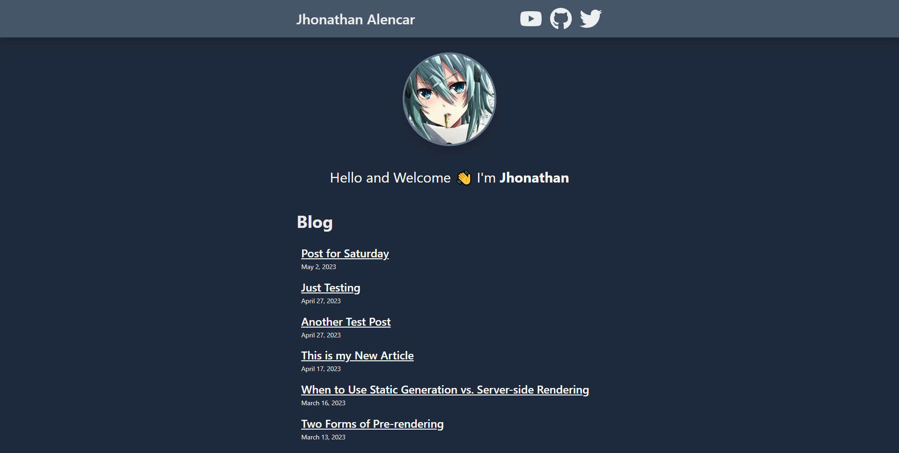

<h1 align="center">Remote MDX Blog</h1>

<p align="center">
  
</p>

<br>

<p align="center">
  
</p>

## 💻 Projeto

Aplicação de um blog utilizando arquivos mdx.

## 🧪 Tecnologias

Esse projeto foi desenvolvido com as seguintes tecnologias:

- [Next.js](https://nextjs.org/)
- [TypeScript](https://www.typescriptlang.org/)
- [Tailwind CSS](https://tailwindcss.com/)

## 🚀 Como executar

```bash
# Clone este repositório
$ git clone https://github.com/jhonathanalencar/nextjs-remote-mdx-blog.git

# Entre na pasta
$ cd nextjs-remote-mdx-blog

# Instale as dependências
$ npm install

# Execute a aplicação em modo de desenvolvimento
$ npm run dev

# A aplicação inciará na porta:3000
acesse <http://localhost:3000>
```

## 📝 Licença

Esse projeto está sob a licença MIT. Veja o arquivo [LICENSE](LICENSE) para mais detalhes.

---

<p align="center">
  
</p>
